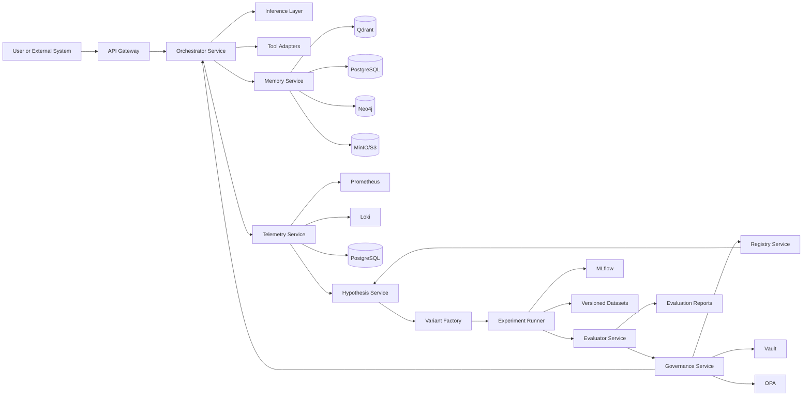

# 自我进化模型系统架构设计

## 1. 目标

本文件将现有设计稿与技术栈方案进一步收敛为系统级架构。目标是明确以下内容：

- 哪些服务需要独立存在
- 服务之间如何通信
- 数据如何流动
- 哪些路径属于在线主链路
- 哪些路径属于离线进化链路
- 哪些节点承担治理与安全职责

## 2. 架构原则

系统分成四个平面：

- 在线执行平面：处理真实任务请求。
- 进化实验平面：生成候选变体并运行实验。
- 数据记忆平面：沉淀任务数据、实验数据和长期知识。
- 治理控制平面：审批、发布、回滚、审计和策略控制。

这样拆分的原因很明确：

- 在线链路要稳定、低延迟。
- 进化链路要高探索、可隔离。
- 数据链路要可追踪、可回放。
- 治理链路要独立于候选变体本身。

## 3. 服务划分

### 3.1 API Gateway

职责：

- 接收外部请求
- 用户鉴权
- 路由到 orchestrator
- 注入 trace id 与 request id

建议技术：

- FastAPI 或网关层 Nginx/Traefik + FastAPI

### 3.2 Orchestrator Service

职责：

- 驱动在线任务工作流
- 调用主模型、工具、记忆服务
- 记录任务轨迹
- 产出运行结果与状态摘要

建议技术：

- FastAPI + LangGraph + Pydantic

### 3.3 Memory Service

职责：

- 统一封装情节记忆、语义记忆、结构记忆
- 对外提供检索与写入接口
- 管理 embedding、向量检索和图谱关系更新

建议技术：

- Python service + Qdrant + PostgreSQL + Neo4j + MinIO

### 3.4 Telemetry Service

职责：

- 接收 trace、log、metric
- 聚合失败模式和异常模式
- 为进化系统提供可消费监控摘要

建议技术：

- OpenTelemetry + Prometheus + Loki + PostgreSQL

### 3.5 Hypothesis Service

职责：

- 从监控摘要和失败案例生成改进假设
- 做第一轮风险分级
- 生成可实验的候选变更提案

建议技术：

- LangGraph + 主模型 API/本地模型 + 规则过滤器

### 3.6 Variant Factory

职责：

- 将假设转化为具体变体
- 生成 prompt/workflow/config/training recipe
- 输出标准化 variant manifest

建议技术：

- Python + Jinja2 + Pydantic + Git 版本索引

### 3.7 Experiment Runner

职责：

- 拉起训练或无训练实验
- 执行评估前准备
- 上报实验状态、资源消耗和中间结果

建议技术：

- Celery 或 Prefect
- Docker
- 第二阶段升级 Kubernetes Job

### 3.8 Evaluator Service

职责：

- 执行 benchmark、regression、adversarial、shadow eval
- 汇总多维评分
- 输出裁决输入报告

建议技术：

- pytest + 自定义 runner + FastAPI

### 3.9 Governance Service

职责：

- 审核是否允许晋级
- 校验 OPA 策略
- 记录审批和回滚点
- 驱动灰度发布

建议技术：

- OPA + GitHub Actions/Azure DevOps + Vault + PostgreSQL

### 3.10 Registry Service

职责：

- 记录模型版本、策略版本、变体版本
- 管理父子依赖关系
- 提供可回滚版本树

建议技术：

- MLflow + PostgreSQL

## 4. 逻辑架构图

## 5. 在线链路

在线链路只负责真实任务，不负责自我改写。链路如下：

1. 请求进入 API Gateway。
2. Gateway 完成鉴权和追踪上下文注入。
3. Orchestrator 根据当前生效版本执行任务图。
4. 任务图调用模型、工具和记忆服务。
5. 结果返回给用户。
6. 执行轨迹、指标和日志写入 Telemetry Service。

约束：

- 在线链路不直接触发生产升级。
- 在线链路只写运行数据，不写发布决策。
- 在线模型版本必须来自 Governance 批准后的 Registry 条目。

## 6. 离线进化链路

离线链路负责从历史表现中找出更优候选。链路如下：

1. Telemetry Service 聚合失败模式和性能瓶颈。
2. Hypothesis Service 生成改进假设。
3. Variant Factory 输出标准化候选变体。
4. Experiment Runner 在沙箱环境执行实验。
5. Evaluator Service 跑四层评估。
6. Governance Service 决定拒绝、灰度还是晋级。
7. Registry 记录新版本并更新依赖关系。

关键约束：

- 候选变体无法直接访问发布接口。
- 评估器与候选变体代码仓隔离。
- 发布规则由 OPA 独立托管。

## 7. 核心数据流

系统核心数据流分为六类：

- request_trace：每次任务执行的全链路轨迹
- task_outcome：任务成功率、失败原因、人工接管情况
- hypothesis_manifest：每次改进假设的来源与解释
- variant_manifest：变体定义、风险等级、预算限制
- evaluation_report：多维评估结果与裁决建议
- release_record：灰度、签名、审批、回滚点信息

## 8. 部署建议

### 8.1 MVP 部署

- 一套 Docker Compose 环境
- 一个 Python 主服务容器
- 一个 Celery worker 容器
- 一个 PostgreSQL
- 一个 Redis
- 一个 Qdrant
- 一个 MinIO
- 一个 MLflow

这足够支撑策略级自优化闭环。

### 8.2 成长期部署

- 在线服务和实验服务拆 namespace
- 引入 Kubernetes Job 跑实验
- 引入 Prometheus/Grafana/Loki
- Governance 独立为单独服务

### 8.3 平台化部署

- 多 GPU 节点
- 独立实验队列
- 多租户控制台
- 统一注册与审批中心

## 9. 服务边界注意事项

需要保持独立的边界有三处：

- Orchestrator 与 Evaluator 必须分离，否则容易自评污染。
- Governance 与 Hypothesis 必须分离，否则容易产生越权晋级。
- Memory Service 与原始对象存储必须通过统一接口隔离，否则数据模式会失控。

## 10. 最终建议

如果现在开始做，建议按照下面顺序落地：

1. 先做 Orchestrator、Memory、Telemetry、Evaluator 四个核心闭环。
2. 再补 Hypothesis、Variant、Governance 三个进化服务。
3. 最后再把控制台、灰度发布和多集群调度平台化。

这样做的好处是先证明系统具备“可优化能力”，再追加“更强自治能力”。